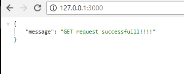
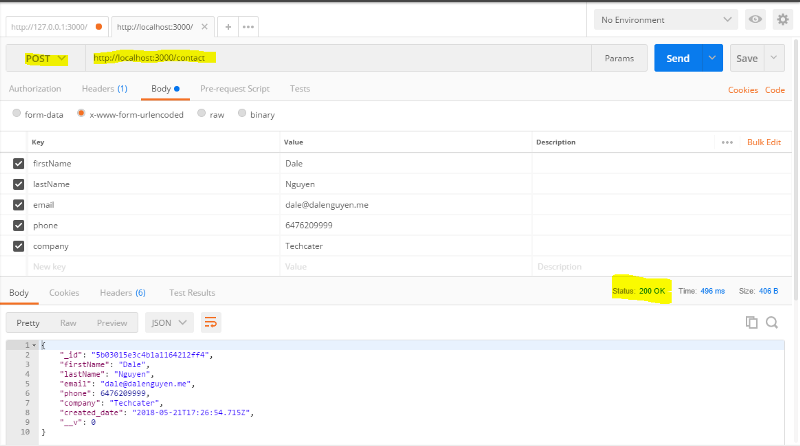
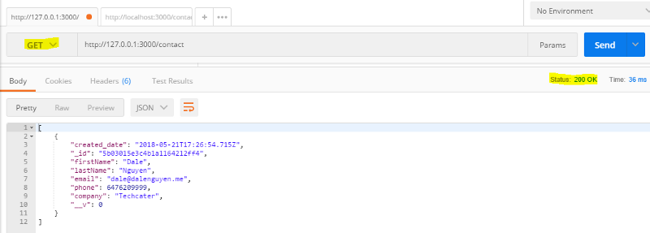
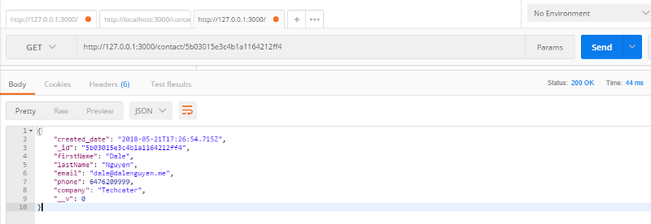
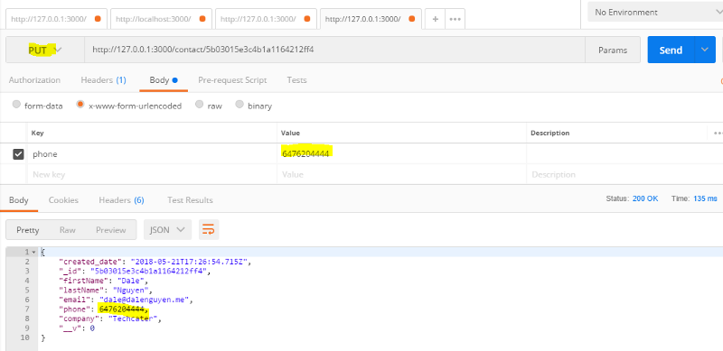
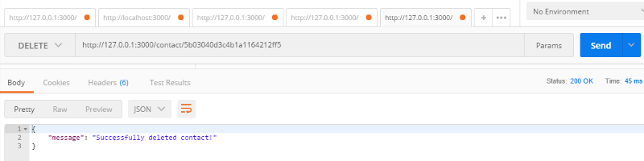

Connect Web APIs to MongoDB
===========================

In this chapter, we will connect the RESTful API application to local MongoDB, but you can connect to any other database services. Please read :ref:`setting-up-project` to install the MongoDB to your machine.

All that you need to do is to import **mongoose package**, and declare URL for your MongoDB in the **app.ts** file. After that you will connect your app with your database through **mongoose**.

.. code-block:: typescript

    // lib/app.ts

    import * as mongoose from "mongoose";

    class App {

        ...
        public mongoUrl: string = 'mongodb://localhost/CRMdb';  

        constructor() {
            ...
            this.mongoSetup();
        }

        private mongoSetup(): void{
            mongoose.Promise = global.Promise;
            mongoose.connect(this.mongoUrl);    
        }

    }

    export default new App().app;

After this, your application is ready to launch *(npm run dev)*

.. image:: images/run-dev-server.png

You can test your first route *(GET /)* through web browser **(http://127.0.0.1:3000)**

Remember that all the routes that we set is **in lib/routes/crmRoutes.ts** file.

Now, we will test the **Create-Read-Update-Delete** feature though `Postman <https://www.getpostman.com/apps>`_.

1. Create your first contact
----------------------------

I will send a **POST** request to *http://127.0.0.1:3000/contact* with the information of a contact in the body.

Remember to set the content-type in Headers

.. code-block:: text

    Content-Type: application/x-www-form-urlencoded

After sending, the server return the status *200* with contact information in the database.

2. Get all contacts
-------------------

To get all contacts, we just need to send a **GET** request to http://127.0.0.1:3000/contact. You will get an Array of all the contacts in the databse. Now there is only one contact that I just created.

3. Get contact by Id
--------------------

If we want to get a single contact by Id, we will send a **GET** request to http://127.0.0.1:3000/contact/:contactId. It will return an Object of your contact. Remember that the ID that we passed to the URL is the **_id** of the contact.

4. Update an existing contact
-----------------------------

In case we want to update an existing contact, we will send a **PUT** request to the http://127.0.0.1:3000/contact/:contactId together with the detail. For example, I will update the phone number of the contact with **_id**: **5b03015e3c4b1a1164212ff4**

5. Delete a contact
-------------------

To delete a contact, we will send a **DELETE** request to http://127.0.0.1:3000/contact/:contactId. It will return a message saying that “Successfully deleted contact!”

After this, now we have a fully working RESTful Web APIs application with TypeScript and Nodejs.