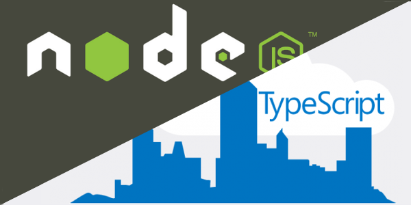

Building RESTful Web APIs with Node.js, Express, MongoDB and TypeScript
===================================================================================================

This is a simple API that saves contact information of people.

There are two versions of this project.

`V1.0.0: <https://github.com/dalenguyen/rest-api-node-typescript/tree/v1.0.0>`_ you can run the server directly after cloning this version. It will create a simple RESTful API over HTTP.

`V2.0.0: <https://github.com/dalenguyen/rest-api-node-typescript/tree/v2.0.0>`_ this is a more secure and control API project. You need to read the post on how to secure RESTful API application first. After that, you can run the project.

    (Image from OctoPerf)

.. toctree::
   :maxdepth: 2
   :caption: Contents:

   introduction
   setting-up-project
   implement-routing-and-crud
   using-controller-and-model
   connect-web-apis-to-MongoDB
   security-for-our-web-apis

Indices and tables
==================

* :ref:`genindex`
* :ref:`modindex`
* :ref:`search`
