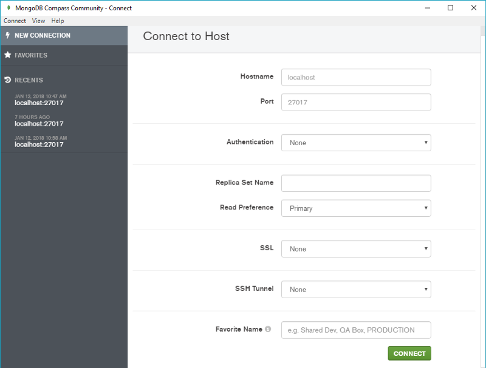
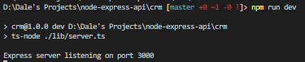

.. _setting-up-project:

Setting Up Project
==================

Before we get started
---------------------

Make sure that you have `NodeJS <https://nodejs.org/en/>`_ installed on your machine. After that, you have to install TypeScript and TypeScript Node.

.. code-block:: bash

    npm install -g typescript ts-node

In order to test HTTP request, we can use `Postman <https://www.getpostman.com/apps>`_ to send sample requests.

MongoDB preparation
-------------------

You should install `MongoDB <https://docs.mongodb.com/manual/administration/install-community/>`_  on your local machine, or use other services such as `mLab <https://mlab.com/>`_  or `Compose <https://www.compose.com/compare/mongodb>`_ 

If you installed MongoDB locally, you should install either `Robo Mongo <https://robomongo.org/>`_  or `Mongo Compass <https://docs.mongodb.com/compass/master/install/>`_  for GUI interface.

    *MongoDB Compass GUI Interface*

Before we dive into the coding part, you can checkout `my github repository <https://github.com/dalenguyen/rest-api-node-typescript>`_  if you want to read the configuration in advance. Otherwise, you just need to follow the steps in order to get your project run.

Step 1: Initiate a Node project
-------------------------------

Create a project folder and initiate the npm project. Remember to answer all the question, and you can edit it any time after that

.. code-block:: bash

    mkdir node-apis-project
    cd node-apis-project
    npm init 

Step 2: Install all the dependencies
------------------------------------

.. code-block:: bash

    npm install --save @types/express express body-parser mongoose nodemon

Step 3: Configure the TypeScript configuration file (tsconfig.json)
-------------------------------------------------------------------

The idea is to put all the TypeScript files in the **lib folder** for development purpose, then for the production, we will save all the Javascript files in the **dist folder**. And of course, we will take advantage of the ES2015 in the project.

.. code-block:: json
    
    {
        "compilerOptions": {
            "module": "commonjs",
            "moduleResolution": "node",
            "pretty": true,
            "sourceMap": true,
            "target": "es6",
            "outDir": "./dist",
            "baseUrl": "./lib"
        },
        "include": [
            "lib/**/*.ts"
        ],
        "exclude": [
            "node_modules"
        ]
    }

So whenever we run the tsc command, all the ts files in the lib folder will be compiled to js files in the dist folder

.. code-block:: bash
    
    tsc

Step 4: edit the running scripts in package.json
------------------------------------------------

.. code-block:: json

    {        
        "scripts": {
            "build": "tsc",
            "dev": "ts-node ./lib/server.ts",        
            "start": "nodemon ./dist/server.js",
            "prod": "npm run build && npm run start"
        }
    }

So, for the development, we can run a test server by running

.. code-block:: bash

    npm run dev

For production

.. code-block:: bash    

    npm run prod

Step 5: getting started with the base configuration
---------------------------------------------------

You will need sooner or later the package `body-parse <https://github.com/expressjs/body-parser>`_  for parsing incoming request data.

.. code-block:: typescript

    // lib/app.ts

    import * as express from "express";
    import * as bodyParser from "body-parser";

    class App {

        public app: express.Application;

        constructor() {
            this.app = express();
            this.config();        
        }

        private config(): void{
            // support application/json type post data
            this.app.use(bodyParser.json());
            //support application/x-www-form-urlencoded post data
            this.app.use(bodyParser.urlencoded({ extended: false }));
        }

    }

    export default new App().app;

Create **lib/server.ts** file

.. code-block:: typescript

    // lib/server.ts

    import app from "./app";
    const PORT = 3000;

    app.listen(PORT, () => {
        console.log('Express server listening on port ' + PORT);
    })

From now, although you can not send a HTTP request yet, you still can test the project by running **npm run dev**.

